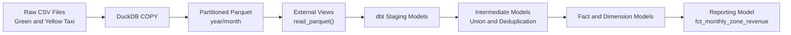

# NYC Taxi Analytics Engineering with dbt + DuckDB

This project is part of **Data Engineering Zoomcamp – Module 4 (Analytics Engineering)**.

It demonstrates how to transform raw NYC Taxi data (Green & Yellow 2019–2020) into analytics-ready models using:

- dbt Core
- DuckDB
- Docker
- Parquet optimization
- Production-style tuning

---

# 🏗️ Architecture



## ⚙️ Performance Optimization

- Converted CSV → Partitioned Parquet
- Limited DuckDB threads to 1
- Configured memory and temp directory


Large CSV files caused memory pressure and slow queries.

To optimize:

### 1️⃣ Convert CSV to Partitioned Parquet

```sql
COPY (
    SELECT *,
           year(lpep_pickup_datetime) AS year,
           month(lpep_pickup_datetime) AS month
    FROM read_csv_auto('data/green_tripdata_*.csv.gz')
)
TO 'data/parquet/green'
(FORMAT PARQUET, PARTITION_BY (year, month), COMPRESSION ZSTD);
````

Same process applied for Yellow taxi.

---

### 2️⃣ Use External Parquet Views

```sql
CREATE OR REPLACE VIEW prod.green_tripdata AS
SELECT * FROM read_parquet('data/parquet/green/**/*.parquet');

CREATE OR REPLACE VIEW prod.yellow_tripdata AS
SELECT * FROM read_parquet('data/parquet/yellow/**/*.parquet');
```

---

### 3️⃣ Memory & Thread Optimization (DuckDB)

Before running heavy queries:

```sql
SET memory_limit='6GB';
SET threads=1;
SET preserve_insertion_order=false;
```

And run dbt with:

```bash
dbt run --target prod --threads 1
```

This prevents Out-of-Memory errors on machines with ~16GB RAM.

---

## 🧱 dbt Models

* staging:

  * stg_green_tripdata
  * stg_yellow_tripdata

* intermediate:

  * int_trips_unioned
  * int_trips (deduplicated)

* marts:

  * fct_trips
  * dim_zones
  * dim_vendors

* reporting:

  * fct_monthly_zone_revenue

---

## 📊 Homework Results

| Question | Answer                            |
| -------- | --------------------------------- |
| Q1       | int_trips_unioned only            |
| Q2       | dbt fails with non-zero exit code |
| Q3       | 12,184                            |
| Q4       | East Harlem North                 |
| Q5       | 384,624                           |
| Q6       | 43,244,693                        |

---

## 🚀 How to Run

Start Docker:

```bash
docker run -it \
  -v $(pwd)/taxi_rides_ny:/app/taxi_rides_ny \
  -v $(pwd)/profiles:/root/.dbt \
  dbt-zoomcamp
```

Inside container:

```bash
dbt deps
dbt seed --target prod
dbt run --target prod --threads 1
```

---

## 💡 Key Learnings

* How dbt lineage works (`--select`, `+model`)
* Why Parquet is superior to CSV for analytics
* How memory tuning affects analytical workloads
* Handling large fact tables in DuckDB
* Deduplication using window functions
* Data quality testing with dbt

---

## 👨‍💻 Author

Rahmatulloh
Data Engineering Zoomcamp 2026
